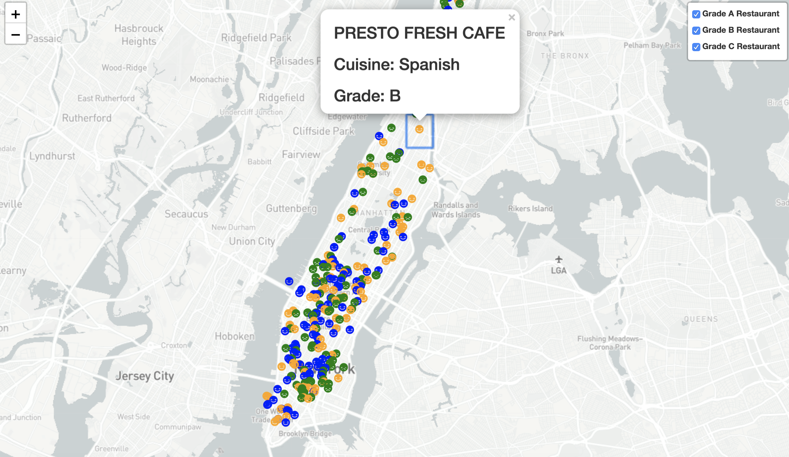

# NYC Department of Health Restaurant Ratings Project
#### Emma Pang, Jenny Yi, Lauren McKinzie, Steve Li, Regana Alicka

Looking at the Department of Health's restaurant health ratings (A, B, C) and violations in Manhattan

This project includes:
Python Flask, HTML/CSS, Javascript, MongoDB, Json data, Leaflet, and Plotly

Note for TA's & Ilya:
We were able to figure out our Leaflet visual (!!!) See all visuals below:

